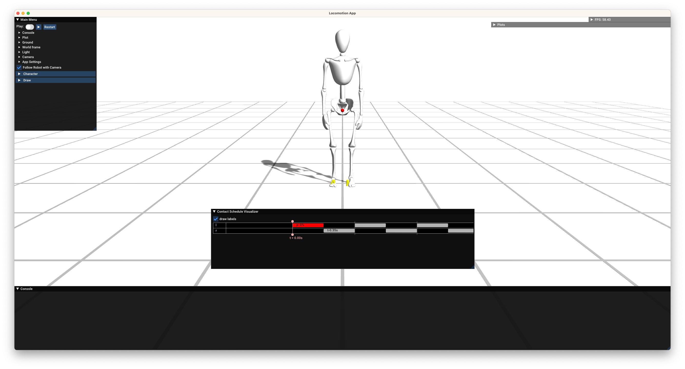

# procedural-locomotion

Code base for the project: Procedural Locomotion Engine For Digital Humans.

## Getting started

We recommend [JetBrains CLion](https://www.jetbrains.com/clion/) for the development.
It is a paid software, but JetBrains has the [student plan](https://www.jetbrains.com/community/education/#students)
that provides free licenses. See [this](https://www.jetbrains.com/help/clion/clion-quick-start-guide.html) for a quick
start guide.

1. Fork this repository and download the code.

2. Build the project (or build `locoApp`). You can build the project in cmake Release mode for realtime performance:
   see [this](https://www.jetbrains.com/help/clion/cmake-profile.html) for a guide about cmake profile for CLion.

3. Run the `locoApp`.

4. Select a model to play with: `Main Menu > Character > Model`. We have `Bob` and `Dog` for examples.



5. Press the space bar to play the app. You can give joystick command with arrow keys in your keyboard. If it does not
   move, don't freak out. It's normal. You have to implement a base (body) trajectory planning strategy as well as a
   inverse kinematics solver: recall [a1](https://github.com/Digital-Humans-23/a1). Once you've done that, you will see
   something like this.


6. Of course, we don't want this crappy walking motion. Now, try your best to generate more natural motions for our poor
   Bob! But first, play around the code, and try understanding it. Don't hesitate to contact Dongho (kangd@ethz.ch) if
   you have any question regarding the implementation.

## Immediate Next steps

- Implement an inverse kinematics solver: ```src/libs/loco/include/loco/kinematics/IK_Solver.h```. Complete TODO part.
- Complete a base (body) trajectory planning
  strategy: ```src/libs/loco/include/loco/planner/LocomotionPlannerHelpers.h```
- Design a strategy for arm motions. Modify ```src/libs/loco/include/loco/planner``` files to implement your strategy.
- Review biomechanics, computer graphics and robotics literature for a natural ankle motion. This is the most
  crucial step for successful demo!

## Comments

- Most likely, you wouldn't need to modify the following source code files in
    - ```src/libs/gui``` and ```src/libs/utils```: basic feature implementation for rendering, mathematical operation
      etc.
    - ```src/libs/loco/include/loco/robot``` and corresponding cpp files.
    - But of course, if you need, feel free to do it.
- This repo will be keep updated, so please stay tuned. If you want to sync your repo with the new commits,
  use ```git rebase``` instead of ```git merge```:
  see [this](https://www.atlassian.com/git/tutorials/merging-vs-rebasing) for more details of ```git rebase```.
- Please actively use GitHub issue for questions and reporting issues on the code base!